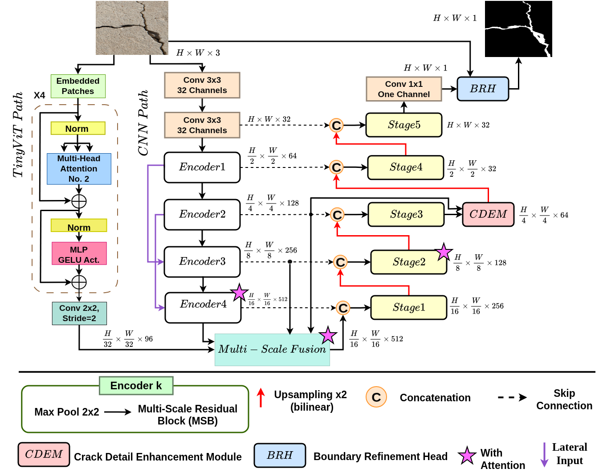

# DMSRCrack   
# DMSRCrack: A Dual-Encoder Multi-Scale Refinement Network for Robust Crack Segmentation across Diverse Domains

## Overview

### Abstract
Cracks are a critical indicator of structural health in concrete and pavement surfaces. However, accurate segmentation remains challenging due to complex textures, varying lighting conditions, and the diverse morphologies of cracks across different domains. To address these challenges, we propose **DMSRCrack**, a Dual-Encoder Multi-Scale Refinement Network.

Our architecture leverages a dual-branch design: a CNN encoder to capture local texture details and a Transformer encoder to model long-range global dependencies. A Multi-Scale Fusion (MSF) module bridges these branches to integrate features effectively, while a Boundary  Refinement Head (BRH) ensures precise boundary delineation. Extensive experiments demonstrate that DMSRCrack achieves state-of-the-art performance, particularly in cross-domain scenarios.


## 📂 Dataset Download

Due to file size limitations, the processed datasets (DeepCrack, Rissblder, etc.) are hosted on Google Drive:

| Resource | Description | Link |
| :--- | :--- | :--- |
| **Datasets** | ALL dataset that used in the paper | [Download Dataset (Google Drive)](https://drive.google.com/drive/folders/1eFRsvghknTze6qdg5FpTy8JMilzlbvGx?usp=sharing) |

<!--

## 🧪 Inference & Weights

We provide a standalone **Test Kit** on Google Drive containing the inference code (`Inference.py`) and the pre-trained weights. This allows you to run the model immediately without setting up the full repository.

| Resource | Description | Link |
| :--- | :--- | :--- |
| **Test Kit** | Inference Code +  Weights | [Download Test Kit](https://drive.google.com/drive/folders/1BI9O2GaCg_HqHYwHNqkgU_dVn6ZhgPSc?usp=sharing) |

-->

## 📚 Citation

If this project contributes to your research, please cite the following publication:

| Resource | Title | Link |
| :--- | :--- | :--- |
| **Paper** | Dual-encoder Multi-Scale Refinement network for robust crack segmentation across diverse domains | [DOI: 10.1016/j.autcon.2026.107004](https://www.sciencedirect.com/science/article/pii/S0926580526002451) |

```bibtex
@article{ALSAMEAI2026107004,
title = {Dual-encoder Multi-Scale Refinement network for robust crack segmentation across diverse domains},
journal = {Automation in Construction},
volume = {188},
pages = {107004},
year = {2026},
issn = {0926-5805},
doi = {https://doi.org/10.1016/j.autcon.2026.107004},
url = {https://www.sciencedirect.com/science/article/pii/S0926580526002451},
author = {Habeb Al-Sameai and Radhwan A.A. Saleh and Joaquim de Moura and Rustu Akay}
}
